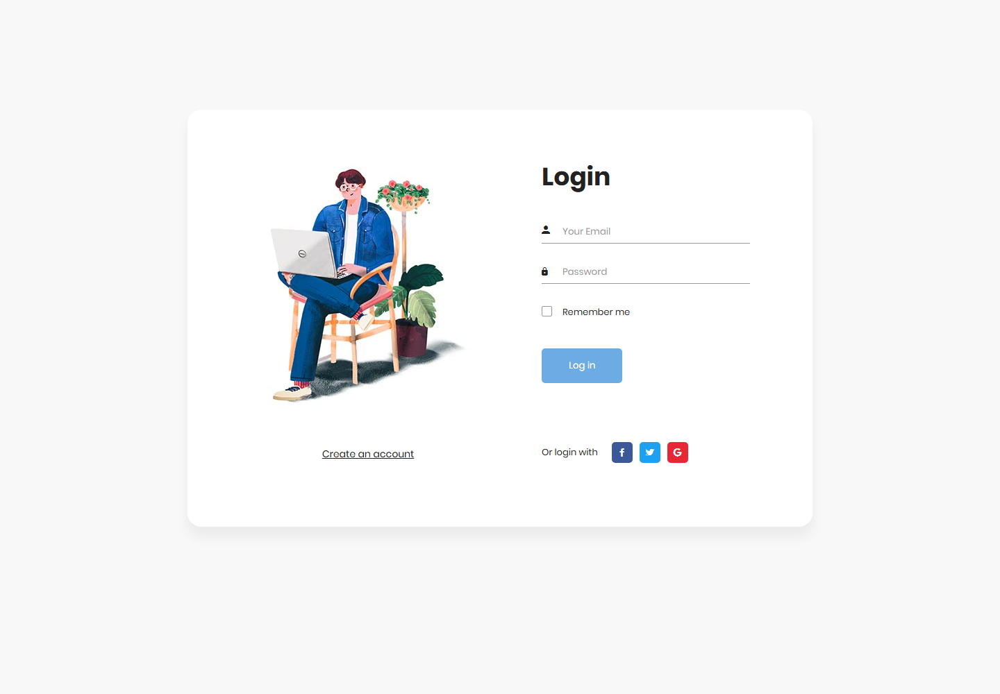
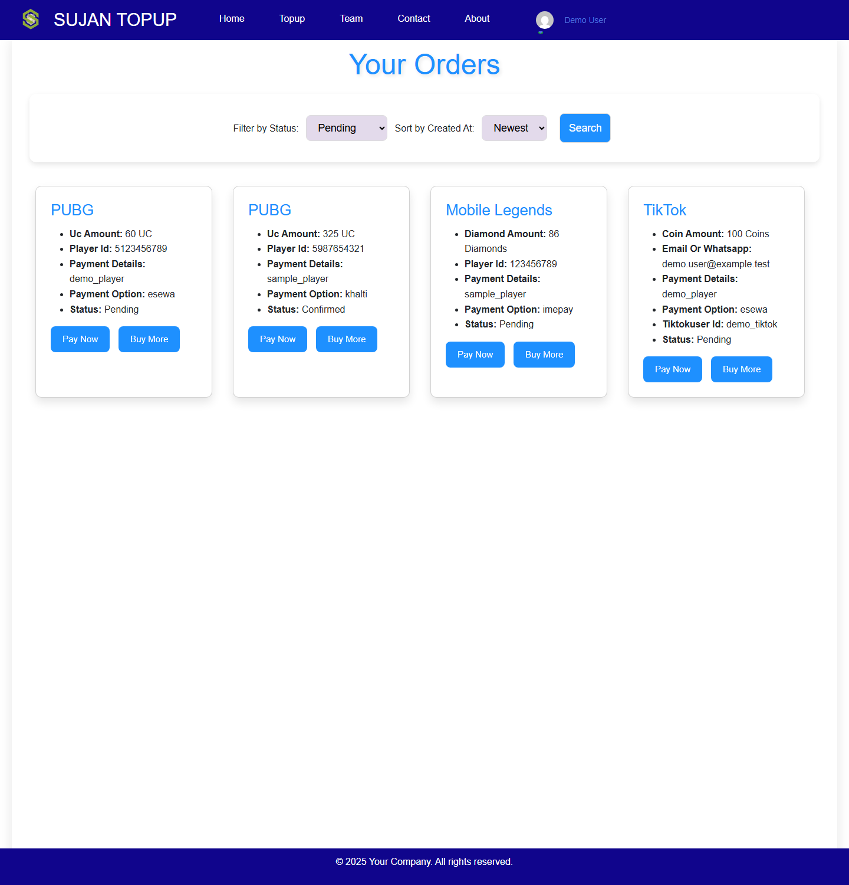
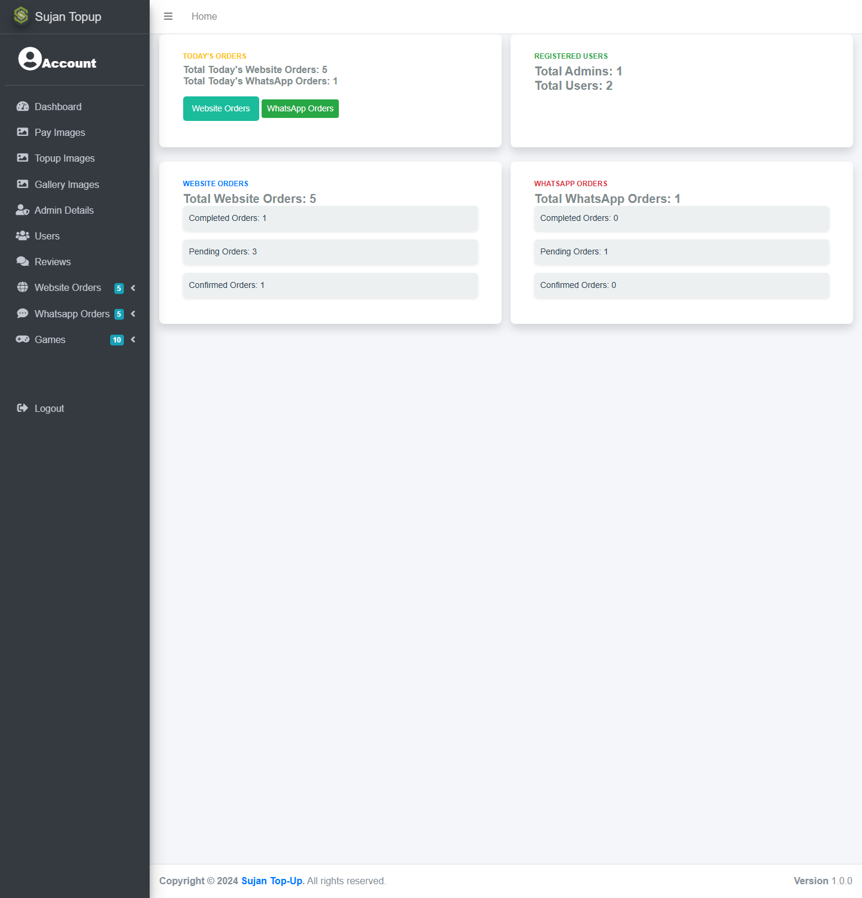
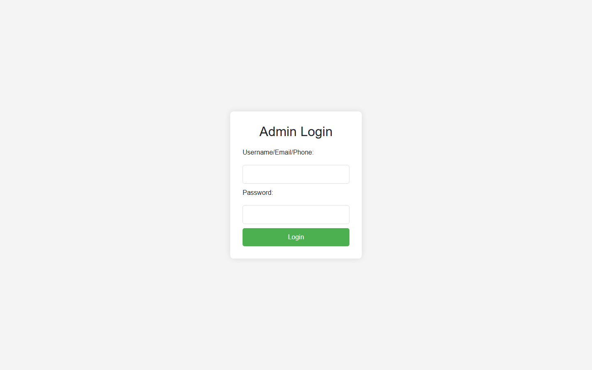
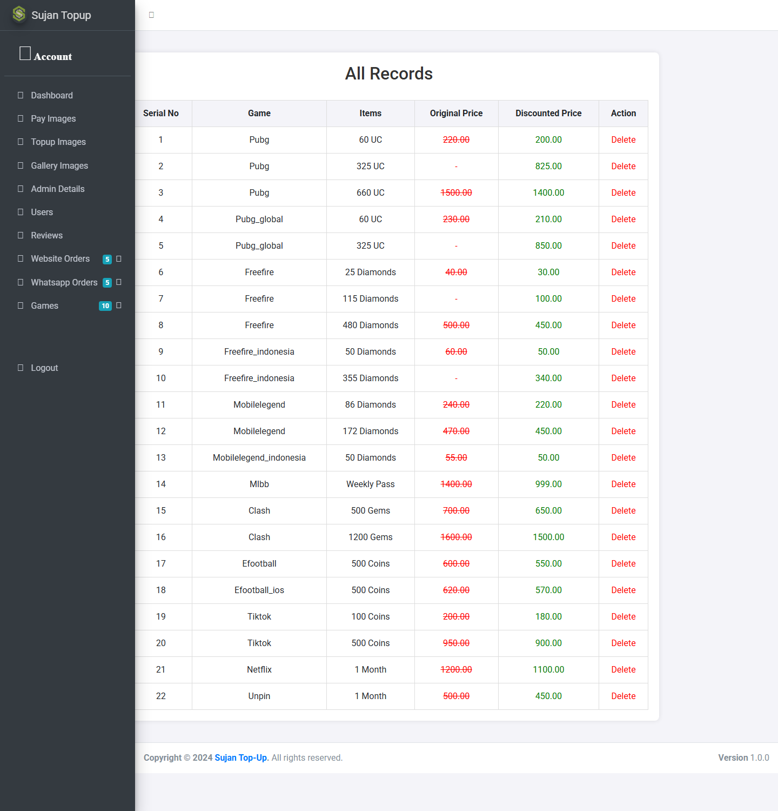

# Sujan Top-Up

A legacy PHP/MySQL gaming and streaming **top-up** web application, preserved
as an open-source portfolio project.

The public repository contains **fictional demonstration data only**. Original
production/customer information, credentials, hosting backups and uploaded
customer media are intentionally excluded.

---

## Project Evolution

Sujan Top-Up was built roughly **2–3 years ago** as an early PHP/MySQL learning
project. It was originally used as a real gaming top-up website in Nepal —
customers bought in-game currency (PUBG UC, Free Fire diamonds, Mobile Legends
diamonds, and more) and streaming subscriptions, with orders handled through the
site and WhatsApp.

The business has since been shut down. In **2026** the codebase was revisited
primarily to:

- remove all private/production data,
- centralise configuration,
- rebuild a fictional demo database,
- fix major compatibility and security issues,
- document the architecture,
- make the project locally reproducible, and
- preserve it publicly on GitHub.

This is a **preservation and modernisation pass**, not a new build. The original
architecture, quirks and per-service order tables are intentionally retained to
document how the application actually worked.

## Demo Preview

| | |
|---|---|
| Home / services | `http://localhost/sujan/index.php` |
| User login | `http://localhost/sujan/sign/login.php` |
| Admin login | `http://localhost/sujan/admin/sign/login.php` |

Screenshots are in [`docs/images/`](docs/images).

## Features

| Feature | Status |
|---------|--------|
| Gaming / streaming service catalog | Implemented |
| Service pricing packages (DB-driven) | Implemented |
| User signup with email OTP | Implemented (email optional) |
| User login / logout (prepared statements, CSRF, session regeneration) | Implemented |
| Forgot-password reset tokens | Implemented (email optional) |
| Order creation (website) and WhatsApp hand-off | Implemented |
| Order tracking & status | Implemented |
| Order cancellation by the owning user | Implemented |
| Customer reviews & ratings | Implemented |
| Admin dashboard | Implemented |
| Admin order management (status, delete) | Implemented |
| Admin game / pricing / image management | Implemented |
| Admin user & review management | Implemented |
| Manual / offline payment methods | Implemented |
| Real payment gateway integration | **Not implemented** (manual only) |
| Twilio SMS / WhatsApp automation | **Not implemented** (WhatsApp is `wa.me` links only) |
| Offline PWA / service worker | **Not implemented** (manifest only) |

> The table above is deliberately honest. Earlier drafts of this README claimed
> instant automated delivery, Twilio automation and offline PWA support — none
> of which exist in the code.

## Supported Demo Services

PUBG Mobile, PUBG Mobile Global, Free Fire, Free Fire Indonesia, Mobile Legends,
Mobile Legends Indonesia, MLBB (Weekly Pass), Clash of Clans, eFootball
(Android & iOS), TikTok, Netflix, Unpin, Spotify and Prime Video.

Catalog entries are database-driven (`games` and `game_images`); the public demo
ships **fictional prices** and placeholder art.

## User Flow

1. Browse the home page and pick a game/service.
2. Choose a package (diamonds / UC / coins / gems).
3. Enter the required player / account details.
4. Choose a payment option (eSewa, Khalti, IME Pay, Bank Transfer — manual).
5. Submit the order, or continue on WhatsApp for guest orders.
6. Track order status from **Your Orders**.
7. Cancel an order while it is still pending/confirmed.
8. Submit a review from the reviews section.

## Admin Features

Dashboard statistics, website orders (all / today / pending / confirmed /
completed / rejected), WhatsApp orders, users, reviews, per-service game/pricing
management, game-image and gallery/video management, admin profile and password
change.

## Tech Stack

| Layer | Technology |
|-------|------------|
| Backend | PHP 8.x (works on 8.1–8.3) |
| Database | MySQL / MariaDB |
| Front-end | HTML5, CSS3, vanilla JavaScript |
| Public UI | Bootstrap 5, AOS, Swiper, GLightbox, Bootstrap Icons, Font Awesome |
| Admin UI | AdminLTE |
| Email | PHPMailer (optional) |
| Config | `.env` file + central `config/` |

## Project Structure

```
sujan/
├── index.php                 # Landing page + service catalog
├── order.php                 # User order tracking + payment proof
├── profile.php               # User profile
├── feed.php / feedphp.php    # Review submission + listing
├── forgot_password.php       # Password reset request
├── r.php                     # Password reset (token)
├── payment_proof.php         # Secure payment-photo upload
├── cancel_order.php          # Order cancellation (owner only)
├── sendOtp.php / otpsend.php # OTP senders (graceful without SMTP)
├── game pages (ptptop.php, ftptop.php, clatop.php, ...)
├── games/<service>/          # Per-service order handlers (web / whatsapp)
├── config/                   # Central bootstrap, app, database, mailer, uploads
├── database/                 # schema.sql, demo_seed.sql, README
├── admin/                    # Admin panel (AdminLTE)
├── sign/                     # User auth + auth template
├── assets/                   # First-party CSS/JS/images
├── uploads/                  # Runtime uploads (gitignored)
└── docs/                     # Screenshots + legacy audit
```

## Database Setup

```bash
mysql -u root -p -e "CREATE DATABASE sujan_topup_demo CHARACTER SET utf8mb4 COLLATE utf8mb4_unicode_ci;"
mysql -u root -p sujan_topup_demo < database/schema.sql
mysql -u root -p sujan_topup_demo < database/demo_seed.sql
```

- `database/schema.sql` — structure only, no rows.
- `database/demo_seed.sql` — fictional users, admins, catalog, orders, reviews.

See [`database/README.md`](database/README.md) for details.

## Installation

### Prerequisites

- PHP 8.1+ (with `mysqli`, `fileinfo`, `openssl`)
- MySQL 5.7+/MariaDB 10.3+
- Composer (to install PHPMailer)

### Steps

```bash
# 1. Install PHP dependencies
composer install

# 2. Create your environment file
cp .env.example .env        # then edit DB settings

# 3. Import the demo database (see above)

# 4. Serve it
php -S 127.0.0.1:8000
# or point an Apache/Nginx vhost at this directory
```

Then open `http://127.0.0.1:8000/index.php`.

## Demo Credentials

| Role | Login | Password |
|------|-------|----------|
| User | `demo.user@example.test` | `DemoUser@123` |
| Admin | `demo_admin` (or `demo.admin@example.test`) | `DemoAdmin@123` |

Passwords are stored only as `password_hash()` values in the seed file. There is
no built-in administrator in the PHP source.

## Configuration

All configuration lives in `.env` (gitignored). Copy `.env.example` to start.

| Variable | Purpose |
|----------|---------|
| `APP_NAME`, `APP_URL`, `APP_ENV`, `APP_DEBUG` | Application identity/logging |
| `DB_HOST`, `DB_PORT`, `DB_NAME`, `DB_USER`, `DB_PASSWORD` | Database |
| `SUPPORT_EMAIL`, `SUPPORT_PHONE`, `WHATSAPP_NUMBER` | Public contact (placeholders) |
| `PAYMENT_INSTRUCTIONS` | Manual payment note |
| `MAIL_HOST`, `MAIL_PORT`, `MAIL_USERNAME`, `MAIL_PASSWORD`, `MAIL_FROM`, `MAIL_FROM_NAME` | SMTP (optional) |

**Email is optional.** With no SMTP credentials configured, OTP and password
reset pages explain that delivery is unavailable instead of crashing.

## Screenshots

| | |
|---|---|
|  |  |
|  |  |
|  |  |
|  |  |
|  |  |

## Security Notes

This is a **demo/portfolio** codebase, not production-grade software. See
[`SECURITY.md`](SECURITY.md) for how to report issues and for the list of
limitations. Highlights of what was fixed for the public release:

- hard-coded DB/SMTP credentials removed (`.env` now),
- hard-coded default admin removed,
- SQL injection in gallery/video upload removed (prepared statements),
- CSRF on order status/deletion/cancellation,
- IDOR fixed (ownership checks),
- hardened file uploads (allowlist, MIME sniff, size, randomised names),
- admin endpoints require an authenticated admin session.

## Known Limitations

- Orders use per-service tables instead of one normalised table.
- The eFootball flow stores a user-supplied in-game password — legacy behaviour,
  demo data only; never enter real credentials.
- Payments are manual/offline; no gateway integration.
- WhatsApp orders are simple `wa.me` hand-offs.
- `manifest.json` exists but there is no service worker (no offline support).
- Some legacy pages duplicate markup; the public demo reuses shared helpers
  where safe.

## Roadmap

- Consolidate per-service order tables into a single `orders` table.
- Add an automated test suite (at minimum, page smoke tests).
- Optional: a real payment gateway integration behind configuration.
- Optional: a proper service worker for offline support.

## Contributing

See [`CONTRIBUTING.md`](CONTRIBUTING.md). In short: never commit secrets, real
personal data, uploaded media, `vendor/` or `node_modules/`.

## License

The original project code is released under the [MIT License](LICENSE).
Bundled third-party libraries remain under their own licenses — see
[`THIRD_PARTY_NOTICES.md`](THIRD_PARTY_NOTICES.md).

---

*Preserved and sanitized in 2026. The public repository contains fictional
demonstration data only.*
